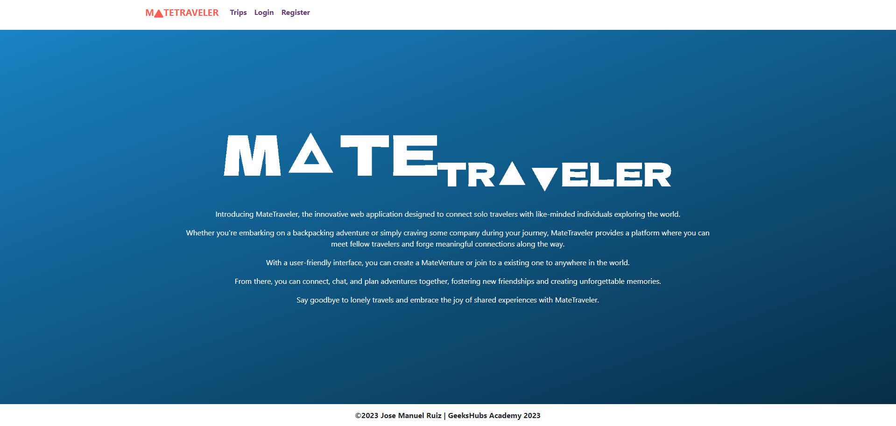
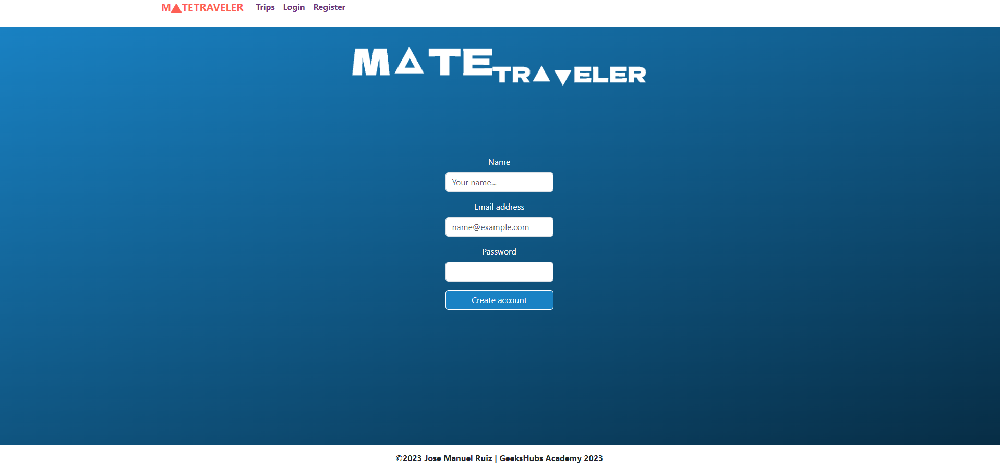
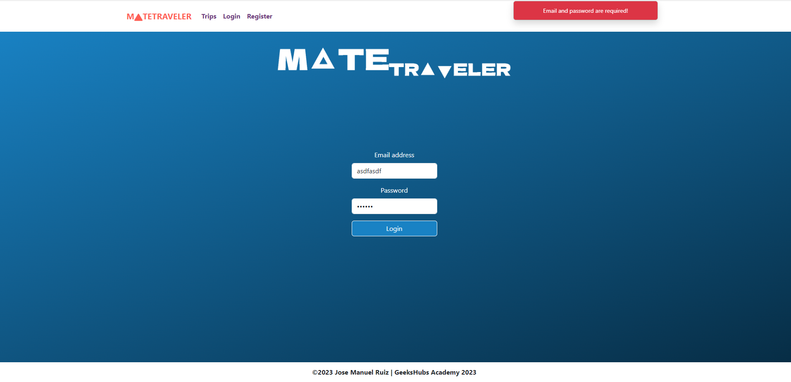
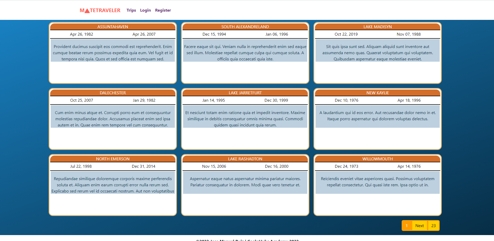
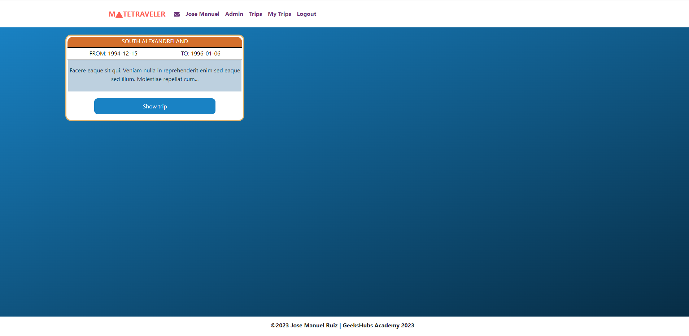
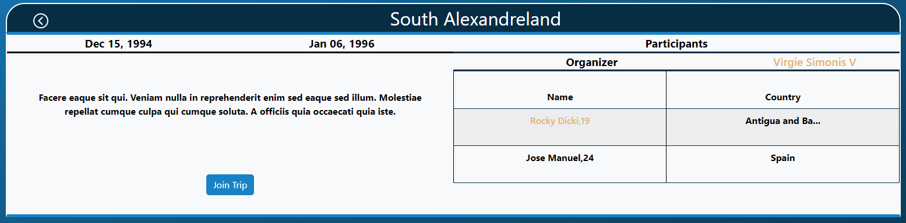
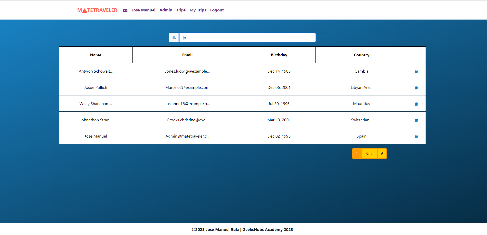
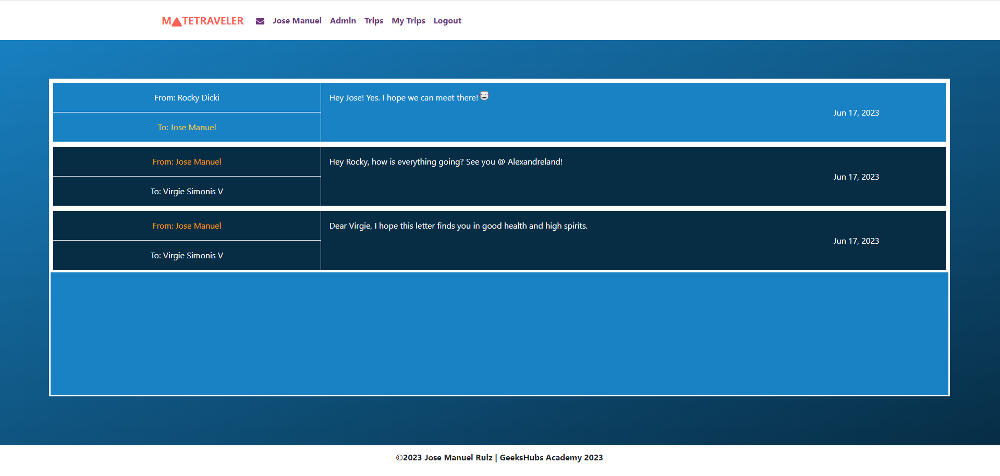

# Mate Traveler FrontEnd - JavaScript, React

##### Hello there! 

This is the frontend of my latest project at GeeksHubs Academy. I have use React as the main technology for my frontend because is a JavaScript library that allows building reusable user interfaces. It promotes component-based development and virtual DOM for faster rendering and updates.

##### Technologies used:

MateTraveler is an application designed to connect people while they are traveling. Whether you are traveling alone or with friends, this app allows you to find and connect with others who are going to the same destination. You can communicate with them through private messages, which are only visible to you and the other person.

There are two roles in this application: traveler and organizer.

As a traveler, you can join trips, message other people, edit your profile, and delete your own trips.

As an organizer, you have the same abilities as a traveler, but you also have the option to create trips so others can join you.

The admin role has all permissions and additionally has the ability to delete user accounts.

Please let me know if you need any further assistance or if you have any specific questions!

##### You can check the <a href="https://mate-traveller-frontend.vercel.app">web</a> "https://mate-traveller-frontend.vercel.app"

Here are the credentials in case you want to test it as admin:

##### ADMIN
###### email: admin@matetraveler.com
###### password: password

##### ORGANIZER
###### email: carmen.valley@hotmail.com
###### password: password

##### Otherwise you can <a href="https://mate-traveller-frontend.vercel.app/register">register</a> here.

#### INDEX

#### REGISTER

#### LOGIN

#### TRIPS
Here you can see all trips available. As we are not logged in we cannot see the detailed information such as other people joined.

#### MY TRIPS
Now, you can see that we are logged in and we are on "My Trips" tab. You can see how this user has no trips.

#### TRIP DETAILS
Here you can see the trip detail and the people who has joined the trip

#### ADMIN BOARD
This is the admin board, he can search by anything to filter
users and also delete this users.

#### MESSAGES
Here you can see your latest messages. You can difference the sent ones from the recieved ones.

Thanks for reding, you can reach me by these socials:

